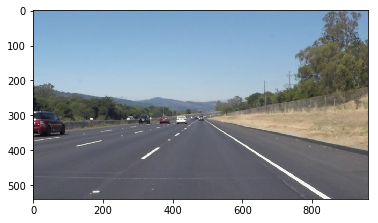
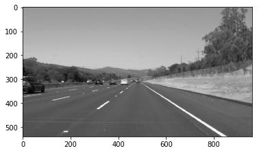
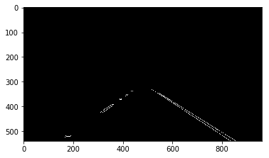
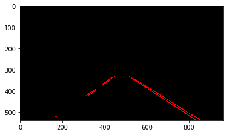
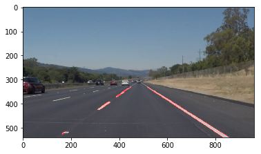

# Self Driving Car Project
Self driving car project is personal project of trying to scale/code functions of a real self-driving vehicle.

## 1. Lane Detection
First self-driving car function is lane detection. Two different codes are provided, one is step by step code with visualization in jupyter notebook and second is full pipeline which is ready to use. Both codes are in LaneDetection folder.
If you are planing to use it , only thing you should change is path to the picture beaing used.

`image = mpimg.imread('test_images/solidWhiteRight.jpg')` - change test_images/solidWhiteRight.jpg to your path.

Computer vision is used to :
1. Load image 

2. Convert to grayscale and apply Gaussian Blur

3. Apply Canny Edge Detector

4. Mask area of interest

5. Applying Hough line transform

6. Show final picture with detected lines

